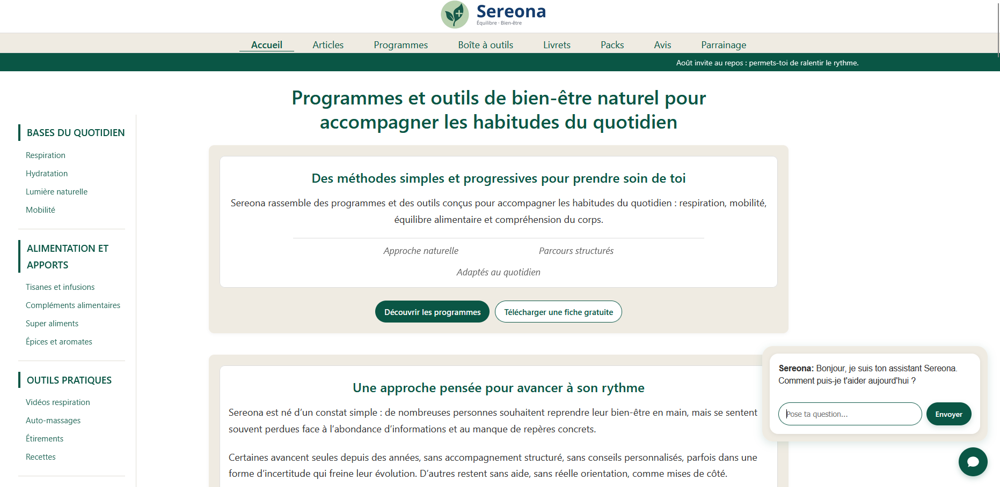

<p align="center">
  
</p>

> 🇬🇧 English | [🇫🇷 Français](./README_FR.md)


<p align="center">
  <a href="https://sereona.fr">
    
  </a>
</p>

# Project Overview

> This repository is a technical presentation and documentation repository.  
> It does not contain downloadable source code or production files.

This repository presents the complete architecture of a website focused on natural wellness,  
designed without CMS, SaaS, cookies, or an exposed application backend.

The entire system runs exclusively on shared hosting,  
without dedicated infrastructure or managed services,  
except for the payment provider.

The project follows a deliberately minimalist and autonomous approach:  
no critical external dependencies, no data collection, and an infrastructure  
designed to operate sustainably on shared hosting.

Due to shared hosting constraints,  
server entry points may be physically located  
within the site layer while remaining  
strictly protected by server-level access rules.

The separation presented in this repository is logical and functional.  
It does not necessarily reflect the exact physical deployment,  
which may vary depending on hosting constraints.

The website is currently deployed in production at [Sereona](https://sereona.fr)

---

## Principles and Goals

The project was designed around clear principles:  

- total autonomy of the infrastructure  
- no unnecessary third-party services  
- no reliance on CMS or server frameworks  
- no user data collection  
- long-term stability and maintainability  
- attack surface minimized to the bare minimum

The goal was not to maximize technical complexity, but to build a robust, readable,  
and predictable system capable of functioning reliably without constant supervision.

---

## General Architecture

The project is structured around three distinct subsystems, deliberately separated by role and exposure level.
This organization helps minimize the attack surface, clarify responsibilities, and ensure simple long-term maintenance.

The architecture is based on the following blocks:  

- `sereona.fr/`: public static site, including protected server entry points  
- `core/`: minimal exposed technical layer (server entry point, access rules)  
- `assistant-node/`: asynchronous internal processing (bot, automation, maintenance)

Each subsystem is logically independent but interacts in a controlled manner with the others.

---

## Project Structure

```
sereona/
├── core/
│    │
│    ├── download_tokens.json          → Temporary tokens related to downloads
│    ├── clean_system_logs.py          → Log cleanup script
│    ├── clean_reviews_logs.py         → Review cleanup script
│    ├── processed_email_states.json   → Automated email response tracking
│    ├── cleanup_download_logs.php     → Download log cleanup
│    ├── cleanup_expired_tokens.php    → Expired token cleanup
│    │
│    ├── tmp/                          → Control / state files
│    ├── vendor/                       → PDF generation library
│    ├── logs/                         → Error logs
│    ├── payment-sdk/                  → Official payment PHP SDK
│    ├── mailer/                       → Email delivery library
│    │
│    ├── data/
│    │   ├── payments/                 → Invoice archive
│    │   └── transactions/             → Transaction records
│    │
│    ├── config/
│    │   ├── paths.php                 → Internal paths configuration
│    │   ├── download_config.php       → Central download configuration
│    │   └── config.example.json       → Example configuration file
│    │
│    ├── modules/
│    │   ├── countries.php             → Country data
│    │   ├── invoice_counter.json      → Invoice numbering counter
│    │   ├── invoice.php               → Factur-X generation orchestrator
│    │   ├── facturx_embed.py          → XML injection into PDF
│    │   ├── generate_facturx_xml.php  → Factur-X XML generation
│    │   ├── invoice_counter.php       → Invoice counter functions
│    │   ├── invoice_mail.php          → Automatic invoice email delivery
│    │   ├── invoice_html.php          → HTML rendering utilities
│    │   └── invoice_pdf.php           → PDF generation functions
│    │
│    └── docs/
│        ├── README_FR.md              → Project overview and architecture (FR)
│        ├── README.md                 → Project overview and architecture (EN)
│        ├── OPERATIONS_FR.md          → Operations and maintenance guide (FR)
│        ├── OPERATIONS.md             → Operations and maintenance guide (EN)
│        ├── OVERVIEW_FR.md            → System overview (FR)
│        └── OVERVIEW.md               → System overview (EN)
│
├── assistant-node/
│    ├── engine_main.py                → Point d’entrée du worker (cron / déclencheur PHP)
│    ├── engine_core.py                → Logique principale du worker
│    ├── engine_reply.py               → Traitement automatisé
│    ├── engine_purge.py               → Maintenance des journaux
│    ├── bridge.php                    → Pont PHP → Python
│    ├── data/                         → Source de données du worker
│    └── tmp/                          → Fichier de contrôle / état
│
└── web/
     ├── library/
     │    ├── invoice_template.php     → Invoice HTML template
     │    ├── payment_success.html     → Page displayed after successful payment
     │    └── payment_cancel.html      → Page displayed after cancelled payment
     │
     ├── payments/
     │    ├── checkout.php             → Payment initialization
     │    ├── download.php             → Download entry point
     │    └── payment_webhook.php      → Payment webhook
     │
     ├── assets/                       → External stylesheets (optional)
     ├── pages/                        → Website HTML pages (articles and content)
     ├── images/                       → Website images (including logos and favicons)
     ├── tmp/                          → Control / state files
     ├── products/                     → Product store
     │
     ├── LICENCE.md                    → Usage conditions and legal framework
     │
     ├── site.webmanifest              → Website PWA manifest
     ├── index.html                    → Home page
     ├── submit_review.php             → Review submission handler
     ├── robots.txt                    → Search engine indexing rules
     ├── sitemap.xml                   → Website sitemap for indexing
     ├── index_hero.js                 → Weekly content initialization script
     ├── weekly-content-2025.js        → Weekly content data — year 2025
     └── weekly-content-2026.js        → Weekly content data — year 2026
```


---

### sereona.fr — public website and server entry points

This directory contains the public-facing website and its controlled server entry points.

It includes the static website resources, user-facing pages and limited PHP endpoints required for specific operations.

No sensitive data or private business logic is stored in this layer.

The public website is the main interaction point with users, while critical processing remains isolated in the private server layer.

---

### core/ — private server logic

This directory contains the internal application layer.

It includes server-side processing, payment handling, invoice generation, Factur-X processing, secure downloads, internal libraries and operational data.

This area is not publicly exposed and is only accessed through controlled server-side execution.

---

### assistant-node/ — internal automation layer

This directory contains internal background processes.

It handles automation tasks, scheduled operations and asynchronous processing.

Execution is limited to:

- scheduled tasks (Cron)  
- controlled internal server calls

No public API, persistent runtime or external service is exposed.

This approach keeps the architecture lightweight, controlled and compatible with a simple hosting environment.

---

## 1. Static Public Site

The public site is built on a deliberately simple and lightweight architecture,  
entirely composed of independent HTML files.  
No CMS, no frameworks, no builders, and no CDNs are used.  
Each page is designed as an autonomous, stable, and reusable unit.

### Key Features

- Fully static site (HTML + standalone CSS)  
- No critical external dependencies  
- Fast and smooth navigation  
- Design focused on visual comfort  
- Simple and predictable structure  
- Exportable and reusable files without adaptation

This choice ensures a fast, robust, and easy-to-maintain site,  
with an extremely reduced risk of failure.

The site also includes lightweight dynamic display scripts,  
allowing certain content to evolve periodically without any backend or client-side storage.

Stylesheets can be integrated autonomously or optionally externalized,  
with no critical dependency on external loading.

---

## 2. Internal Automation (Worker)

The project incorporates an internal automation system, without exposing any application backend to the public.
No Python server is accessible from the outside (no web framework,  
no public APIs, no persistent runtime). All processes are executed exclusively internally.

### How It Works

- Python scripts executed via scheduled tasks (Cron)  
- Controlled triggers from the server  
- Data stored locally in JSON format  
- No unnecessary outgoing communication  
- No direct network exposure

This choice allows for a silent, controlled, and compliant architecture,  
while ensuring the project’s automation and maintenance needs are met.  
The absence of an exposed backend significantly reduces the attack surface and simplifies long-term monitoring.

---

## 2 bis. Internal Assistant and Response Engine

The project integrates an internal assistant designed to guide users and answer targeted questions,  
without exposing complex application logic on the public side.

This assistant relies on an autonomous response engine, implemented in Python and powered by a locally structured JSON database.  
It analyzes incoming queries, identifies keyword and category matches, and then returns tailored responses.

### How It Works

- Response engine executed server-side  
- Deterministic and controlled logic  
- No reliance on external AI services  
- No collection or storage of personal data  
- Local logging of unrecognized queries  
- Traceability of technical errors for maintenance purposes

The assistant does not provide medical advice and is strictly limited to informational and guiding content,  
in line with the project’s scope.  
This choice offers contextual assistance while maintaining a sober,  
predictable architecture that respects security and compliance constraints.

---

## 3. Payment, invoicing and distribution

The project integrates a complete payment, invoicing and distribution pipeline fully controlled on the server side.

The payment provider is only used for transaction validation.

All business logic related to payments is then handled by the Sereona infrastructure:

- payment event processing  
- automatic invoice generation  
- document numbering  
- invoice archiving  
- customer document delivery  
- digital product access management

The goal is to maintain an autonomous architecture where payment processing does not depend on any external automation system.

---

## General pipeline

The complete workflow relies on several controlled steps:

- payment validation  
- server-side transaction confirmation  
- automatic electronic invoice generation  
- assignment of a unique sequential number  
- Factur-X document creation  
- automatic invoice archiving  
- invoice delivery to the customer  
- creation of secure access to the digital product

Invoicing and distribution remain entirely controlled by the Sereona infrastructure.

---

## Factur-X invoicing

Invoices are automatically generated in Factur-X format.

The system combines:

- invoice business data  
- visual PDF rendering  
- embedded structured XML data

Each generated invoice is a complete document containing both a human-readable representation and structured data required for electronic processing.

The archive system is automatically organized to simplify:

- document retention  
- system maintenance  
- administrative access

---

## Secure file distribution

Digital product delivery relies on an internal secure download system.

Resources are never directly exposed through the public website.

After payment validation, a temporary access is generated with:

- server-side authorization checks  
- limited validity period  
- protection against unauthorized access  
- invalidation after use  
- access traceability

Downloads are only processed after validating the rights associated with the purchase.

This architecture provides a clear separation between:

- public website  
- transaction processing  
- electronic invoicing  
- protected digital resources

The entire system operates without external orchestration platforms and keeps sensitive logic under server-side control.

---

## 4. Security and Structural Protection

The project’s security relies primarily on simple and strict structural choices rather than the accumulation of external solutions.  
The architecture has been deliberately designed to minimize the attack surface and reduce exploitable entry points.

### Implemented Measures

- Strict separation between the public site and server-side logic  
- Enhanced access rules at the server level  
- Complete deactivation of directory listing  
- Protection of sensitive files (data, scripts, logs)  
- Critical zones made inaccessible by default  
- No direct URLs to private resources

File names, endpoints, and sensitive data have been deliberately abstracted to limit opportunistic attacks and automated scanning.  
This approach prioritizes simplicity, readability, and long-term passive security.

---

## 5. GDPR Compliance and Data Minimization

The project was designed from the outset with a maximal data minimization approach and regulatory compliance in mind.  
No personal data is collected for tracking, analysis, or profiling purposes.  
The site does not rely on any tracking mechanisms.

### Applied Principles

- No cookies used  
- No third-party trackers or pixels  
- No external analytics tools  
- No local storage on the browser side  
- No user accounts  
- No data collection for marketing purposes

The only data handled by the system is strictly functional, time-limited, and stored locally on the server side.  
This approach ensures native GDPR compliance, without intrusive banners or consent management,  
while respecting the principle of data minimization.

---

## 6. Technical Choices and Sustainability

The technical choices made in this project were guided by the goal of sustainability rather than the pursuit of complexity or novelty.

The architecture does not rely on any server frameworks, persistent application runtimes, or heavy dependencies.  
The components used are deliberately simple, stable, and proven.

### Chosen Principles

- No CMS or server frameworks  
- No dependencies that need continuous maintenance  
- Use of simple, sustainable formats (HTML, JSON, Python)  
- Readable and auditable application logic  
- Compatibility with standard shared hosting environments

This choice drastically reduces maintenance needs, avoids disruptions from updates, and ensures maximum stability in the long term.  
The goal is not technical sophistication, but reliability, predictability, and full control over the system.

---

## Security Notes and Disclosure

This repository provides an accurate view of the project’s logical architecture while respecting responsible disclosure principles.  
Certain file names, endpoints, and structures have been deliberately abstracted or modified to limit any direct exploitation.  
No keys, secrets, real data, or sensitive production paths are present in this repository.  
The exposed structure aims to document technical choices and system organization, without reproducing the exact production environment.

---

## Communication and Automated Maintenance

The project integrates communication mechanisms that are intentionally limited and controlled.

Email notifications are used solely to confirm the receipt of messages or to notify of important technical events.  
User responses are handled manually, by choice, to preserve human interaction.

Additionally, internal scripts ensure automated maintenance:  

- Regular cleanup of temporary files  
- Purging of expired logs and data  
- Maintaining a clean and stable environment over time

---

## Conclusion

This project demonstrates the design of a complete, autonomous, and secure website,  
without relying on external platforms and without unnecessary backend exposure.

It shows that a simple, well-thought-out, and controlled architecture  
can meet real-world needs while remaining sustainable, performant, and compliant.

The system was designed to be reliable in the long term,  
requiring minimal maintenance and reducing the attack surface.

---

© Palks Studio — see LICENSE.md  
- https://palks-studio.com
